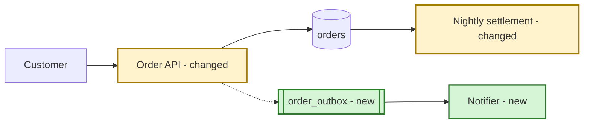

> **Behavioral directive:** Load `Use skill: behavioral-principles` before executing this workflow. These rules govern every step that follows. Then load `Use skill: stack-detect` - the stack names the things the change inventory lists (tables, jobs, queues, config) and the rollout mechanism available; when no project context exists, use the stack stated in the request. If a delegated skill is unavailable (standalone use), apply the step's inline instructions on judgment and say so. Delegated skills supply analysis method, not structure: this skill's Output template is the only output contract - absorb their findings into its sections and never emit their own Output blocks. Two exceptions: Review Mode emits `architecture-review-lens`'s structure, and a house pattern overrides headings, order, and metadata slots (Step 3).

# Epic Design Brief

## Purpose

One reviewer-facing document that gets an epic approved: what changes, why, what breaks, how to undo it, and what decision is being asked for. The analysis behind it runs at full depth; the document shows only what the reviewer needs in order to decide.

## When to Use

- An epic needs sign-off, and approval - not a canonical architecture record - is the outcome that matters.
- The approver carries deep domain knowledge but limited time or limited architecture vocabulary, and stalls on a full HLD.
- One document is wanted, not a design doc plus a summary of it.

Not this workflow: the full 12-section architecture record for a board or a compliance file (`task-design-architecture`); the phased plan to move an existing system between two states (`task-migrate-architecture`); the task graph that builds it (`task-breakdown-design`).

## Relationship to task-design-architecture

**This workflow starts from the epic, not from an HLD.** It runs the design analysis itself in Step 4 and emits only the reviewer-facing result; what it does not show moves to the appendix or waits for a question, and is never skipped. Do not run `task-design-architecture` first as a prerequisite - producing a 12-section proposal the approver will not read is the wasted effort this workflow exists to remove.

Two exceptions:

- **An HLD already exists.** Pass it in; this workflow renders from it and re-derives nothing the HLD states - Step 4's always-loaded atomics run only on what the HLD leaves silent. Content the brief requires that the HLD lacks - most often the back-out data answer - is derived here; when the HLD's silence leaves it unverifiable, mark it `assumed` and carry it into Section 8 by Step 7's rule - a confirm-question when the reviewer can settle it, a spike otherwise. Where the HLD's choice conflicts with a stated requirement, keep the choice and make the conflict the first Decision in Section 8 - the brief surfaces it, it does not re-decide it.
- **A named consumer requires the full artifact** - an architecture board, a compliance file, or a cross-team contract that outlives the epic. Run `task-design-architecture` for that record, then pass its output here for the reviewer-facing render. A named consumer is the bar; habit is not.

## Mode Detection

A pasted brief with no authoring request is **Review Mode** (a pasted full design doc belongs to `task-design-architecture`'s Review Mode). An epic, ticket, or rough scope handed in for design is **Brief Mode** - the author's own sketch inside the request is input, not an artifact under review, and an HLD supplied alongside an authoring request is input to Brief Mode. Default: Brief.

## Inputs

| Input | Required | Description |
| --- | --- | --- |
| Epic or feature | Yes | What must be built or changed, and why |
| Current system | No | The services, tables, jobs, and queues the epic touches - the input the change inventory's accuracy depends on most |
| Reviewer profile | No | Architecture fluency and domain fluency, `High` or `Low` each; default Architecture: Low, Domain: High. An `Approver:` line under `## Design Docs` names the reader but states no fluency - take the identity, keep the default profile, and record the source as `assumed default` |
| Reference doc | No | Company template or an approved prior design, as a path or pasted content |
| Existing HLD | No | An already-written design; the brief renders from it - content, never handed to the reference skill as a pattern |
| Constraints | No | Deadline, compliance, frozen systems, team capacity |
| Author | No | Name and squad, from the request; `TBD` otherwise |

Handle partial input explicitly. A thin current-system input degrades exactly one thing: mark every unverified `Also touches` or `If it goes wrong` cell `assumed` (or `unknown`, Step 5) and carry it into Section 8 by Step 7's rule. That converts the gap into the question this reviewer is best placed to answer. Never fill a cell you cannot support, and never drop the row.

## Workflow

### Step 1 - Behavioral rules

Use skill: `behavioral-principles`.

### Step 2 - Stack

Use skill: `stack-detect`. When the request names a stack and detection returns `unknown`, trust the request and record the assumption.

### Step 3 - Calibrate the reader and the format

Use skill: `design-audience-calibration` for the fluency axes, vocabulary policy, diagram budget, body budget, appendix policy, and its `Reader decides` question - Section 8's ask is written to it. For its component test, an independently deployed component is one that ships on its own release: a new worker inside an existing deployable is not a second component. Use skill: `design-reference-pattern` for the house skeleton, metadata slots, depth convention, and diagram convention.

Supply the reference skill with this workflow's required content - problem, approach and diagram, change inventory, how it works (the flow), why this way, risks, rollout and back-out, the ask - as its required-content list, and state that the deliverable carries no appendix for the required content - its appendix holds depth only - so an item the skeleton cannot house resolves as `appended as <name>`. Follow the mapping it returns, except when it reports `Source: built-in`: then its mapping is ignored and the skeleton is the Output template below - this workflow has its own and does not fall back to that skill's generic headings. When it reports a template or an approved design, the house skeleton governs headings and order, and this template's five metadata bullets ride with the house metadata slots rather than replacing them: any house field this brief does not produce reads TBD, and a house status enum takes its nearest value to this template's.

A house pattern governs headings, order, and metadata slots - the sanctioned exception to the behavioral directive's structure rule. The required content itself never changes: every item resolves as placed in a house heading or appended under its own name - unnumbered, after the house Appendix, in the Output template's order, each carrying one line saying why it was added. A partial fit is a placement when the heading is where the reviewer would look: the inventory under the heading that carries the proposed change (it never relocates - Step 8), the ask under a house open-questions or decisions heading. `## 0. How It Works Today` is the exception and always sits immediately before the first content heading. Nothing is dropped to fit a template, and no house heading is reused for an appended section.

### Step 4 - Analyze (nothing is emitted here)

The rigor lives in this step. **Depth of analysis does not scale with the reviewer's fluency** - the profile governs Step 8, not this one.

Load an atomic with `Use skill: <name>` when its signal fires in the epic:

| Signal | Load | Lands in |
| --- | --- | --- |
| Always | `review-blast-radius` | Inventory `Also touches` and `If it goes wrong` columns; Section 6 |
| Always | `tradeoff-analysis` | Section 5 |
| Always | `ops-release-safety` | Section 7 |
| Schema or stored-data change | `backend-db-migration` | Inventory rows; Section 7 migration order |
| Changed API, event, or export already consumed elsewhere | `ops-backward-compatibility` | Inventory rows; Section 6 |
| New component, or data ownership moving | `system-boundary-design` | Section 2; inventory |
| Writes spanning two stores or services | `architecture-data-consistency` | Section 6; Section 4 or its appendix flow diagram |
| Money, retries, or at-least-once delivery | `backend-idempotency`, `ops-resiliency` | Section 6 mitigations |
| New synchronous dependency between components | `failure-propagation-analysis` | Section 6 |
| Cross-team or cross-service ordering | `dependency-impact-analysis` | Section 7 phases |
| Gradual rollout or a kill switch | `ops-feature-flags` | Section 7 |
| A stated or implied latency, volume, or availability target | `nfr-specification` | Section 6; appendix |
| A new user-visible flow, or a timing change to an existing one | `ops-observability` | Appendix; Section 7 exit criteria |

A signal that fires but yields nothing the reviewer needs in order to decide is recorded in the appendix, not dropped. When the epic's blast radius is wide - core data model, money movement, bulk PII, or an externally consumed contract - the appendix grows and the body budget does not.

### Step 5 - Build the change inventory

This is the section a domain-fluent reviewer evaluates on, and the one that earns their correction. Every row names a real, findable thing: `orders.status`, `POST /v1/orders`, `NotificationWorker`, `settlement.nightly`. "The order flow" is not a row.

- **Trace or flag.** Every row ties back to Section 1's problem. A row that does not is scope creep - surface it in Section 8, do not quietly build it.
- **Find the rows the epic implies but never states.** The batch job that reads the column being changed, the report built on the table being split, the consumer of the event whose shape is moving. These are the highest-value rows in the document.
- **Mark unverified `Also touches` and `If it goes wrong` cells `assumed`.** A cell is verified when it cites the current-system input or code; an inference from either is not, and a cell no inference reaches reads `unknown`. Each `assumed` or `unknown` cell is resolved by Step 7's rule.
- **State what is not changing.** Name the adjacent systems a reviewer would reasonably fear are affected and are not. This is a required line, not an exhaustive inventory.

### Step 6 - Draw the change

Default to Mermaid; follow the house diagram convention when one was found - it replaces the template's fence language. Body diagrams are capped by the calibration's diagram budget - one structural diagram always, one flow diagram when ordering, retries, or async behavior are not obvious from the structure. The budget wins over the flow condition: when it has no room, omit Section 4 and put the flow diagram with its walk-through in the appendix.

- **Mark change state in the label**, not only in color: `Notifier - new`, `Nightly settlement - changed`, unmarked for untouched. Use the hyphen form: unquoted parentheses inside a Mermaid node label are a parse error, so `[Notifier (new)]` will not render. `classDef` coloring is an enhancement some renderers drop; the label suffix is what survives.
- **Carry a legend line** under every marked diagram.
- **Every element exists in the change inventory or in the current system.** Never invent a box to balance a diagram; an untouched box is current-system, not an inventory gap.
- **The diagram comes before the prose that explains it**, at every fluency level.

Prefer one after-state diagram with change marking over a before/after pair. Where domain fluency is Low the calibration adds a current-state section that sits outside the page budget: emit it as `## 0. How It Works Today`, immediately before the first content heading. It is the one section that never relocates - not to the appendix, and not to wherever a house pattern would otherwise place it. Its diagram consumes one of the budget's two slots and Section 2's the other (every Low-domain quadrant budgets two), so Section 4's flow diagram goes to the appendix there. At High domain there is no Section 0: the flow diagram takes the second slot where the budget has one (Low/High) and goes to the appendix at High/High. Outside Section 0, draw a separate current-state diagram only when the change is a restructuring whose delta the marking cannot express.



Legend: "new" = added by this epic, "changed" = existing and modified, unmarked = untouched.

### Step 7 - Frame risk, rollout, and the ask

**Risk.** Each risk is one row: what fails, what the user or the business sees, what is done about it, how it is noticed. The user-visible consequence is the payload - a severity label never replaces it, and appears only when the house template's own risk table carries a column for one. Cap the body at 3-5 risks ordered by user-visible impact, not by likelihood; the rest go to the appendix.

**Rollout and back-out.** Name the phases, who is exposed at each, the switch by name (where the stack has no rollout mechanism, propose one and mark it `assumed`), and the exit criterion per phase - the named signal that lets the next phase start. Stated constraints - a freeze, a deadline, a frozen system - bound the phases and are named there. Back-out states four things: the trigger condition, the action, how long until behavior matches today, and **what happens to data written under the new behavior**. That last one is the risk-averse approver's real question and is the most commonly missing line in a rejected brief. Where a step cannot be undone - a one-shot backfill, a third-party write - name it as the point of no return and state the roll-forward action instead of a restore time (`ops-release-safety`). Invent no dates or estimates - with none supplied, give sequencing and say timing is open.

**The ask.** Three slots:

- **Decisions**, at most three. Each states the question, the options, the recommended option, and the consequence of not taking it. A pre-picked recommendation turns the reviewer's job from inventing an answer into confirming one. Nothing left to decide (an already-approved HLD as input) collapses the block to one line saying so.
- **Confirm from your side.** Every `assumed` or `unknown` cell in Section 3, and every `assumed` value in Section 7 (the switch, the back-out data answer), that the reviewer's own knowledge can settle becomes a confirm-question; cells one answer settles merge into one question. A cell only an engineer can resolve is not a confirm-question - make it a spike (one `Spike:` line in the same block) or an appendix assumption. With readers in different quadrants, address each question to the reader who can settle it by name; a secondary reader's `Also answer` question is answered for them in the body section that owns it, never asked back here. More than four questions means the current-system input was thin - keep the four with the largest `If it goes wrong`, and list the rest as open assumptions in the appendix. Zero `assumed` or `unknown` cells collapses the block to one line saying nothing needs confirming.
- **What approval means**, one line bounding exactly what is being signed off and what would come back for a second look. An approver who knows the edge of their liability approves faster.

### Step 8 - Fit and compress

Apply the house skeleton and metadata slots. Hold the body to the calibration's budget: everything over it moves to the appendix, and nothing is deleted; the change inventory itself never relocates - it is what the reviewer evaluates on, so overflow comes from other sections.

The budget is a target, not a licence to drop required content: where it conflicts with the Output template, the template wins. The Section 2 diagram, the Section 3 inventory and the Section 6 risk table stay in the body - they are what the reviewer decides on. Prose is what compresses and elaboration is what relocates. At the one-page quadrants those three blocks are most of the budget: cut prose to captions, and say in one line that the body is at its floor rather than dropping a block. At Low/Low the inventory stays but is written in outcome language - what each row means for customers or cost - with the identifiers alongside for the technical reader, since the quadrant routes mechanism, not the inventory itself, to the appendix. Then check the body for an unglossed architecture term or acronym, a severity enum standing in for a consequence, a condescension marker, and a diagram element in neither the inventory nor the current system.

## Output Format

````markdown
# <Epic> - Design Brief

- **Written for:** <reviewer or group> - architecture <High | Low> (<stated: <phrase> | inferred: <signal> | assumed default>), domain <High | Low> (<stated: <phrase> | inferred: <signal> | assumed default>). {with readers in different quadrants: each axis carries the lower bound, an author-reader excepted, and names the per-reader values}
- **Author:** <name, squad | TBD>
- **The ask:** <what is being asked for, one clause>
- **Format:** <template: <path or name>{ + approved design: <path or name>} | approved design: <path or name> | built-in>{ - <the pattern's Attribution sentence>}
- **Status:** <For review (default) | Draft, only when the author asked for a working copy>

## 0. How It Works Today

_Include when domain fluency is Low; sits outside the body budget and never relocates. Omit the section entirely otherwise. Its diagram consumes one of the budget's two slots._

```mermaid
<current-state structural diagram, unmarked>
```

<2-4 lines naming the pieces the reader already knows.>

## 1. The Problem

<3-5 lines in domain terms: what happens today, what it costs, why now. No solution.>

## 2. The Approach

```mermaid
<structural diagram; every changed element carries "- new" or "- changed" in its label>
```

<Legend: "new" = added by this epic, "changed" = existing and modified, unmarked = untouched.>

<One paragraph, 3-4 sentences, naming the same pieces the diagram shows.>

## 3. What Changes

| What | Kind | Change | Why | Also touches | If it goes wrong |
| --- | --- | --- | --- | --- | --- |
| `orders.status` | table/column | Modified | <one clause> | Nightly settlement job (assumed) | <user-visible consequence> |

Kind: service | endpoint | table/column | job | event/queue | config | infra | third-party. Change: New | Modified | Removed.

**Not changing:** <adjacent systems a reviewer would reasonably fear are affected, and are not>

## 4. How It Works

_Include when ordering, retries, or async behavior are not obvious from Section 2 and the diagram budget has room; otherwise omit the section (a flow diagram the budget displaced sits in the appendix) and keep the numbering - 3 is followed by 5._

```mermaid
sequenceDiagram
  autonumber
  <the main scenario, end to end>
```

<2-4 lines walking the numbered steps.>

## 5. Why This Way

- **<Decision>:** <chosen> over <alternative>, because <reason>. Cost: <what is given up>. Reversibility: <Easy | Moderate | Hard> - <the work required to change later>. Revisit when: <observable condition>.

<At most three.>

## 6. What Could Go Wrong

| If this fails | What you would see | What we do about it | How we would know |
| --- | --- | --- | --- |
| <failure> | <user-visible consequence> | <mitigation> | <signal> |

<3-5 rows, ordered by user-visible impact; the rest in the appendix.>

## 7. Rollout and Back-out

- **Phases:** <phase - what is live - who is exposed>
- **Switch:** <flag, config, or mechanism, by name>{ (assumed)}
- **Back-out trigger:** <the specific condition, not "if something goes wrong">
- **Back-out action:** <what is done, and how long until behavior matches today>
- **Data written under the new behavior:** <what happens to it on back-out>{ (assumed)}
- **Point of no return:** <the step after which back-out becomes roll-forward, and the roll-forward action | none>
- **Exit criteria:** <per phase: the named signal that says it is working and the next may start>

## 8. What I Need From You

**Decisions**

- **<Question>?** <Option A - recommended> or <Option B>. Choosing B means <consequence>.

<At most three.>

{instead, when nothing is left to decide: one line saying so}

**Please confirm from your side**

- <question only this reviewer's domain knowledge can settle, drawn from an `assumed` or `unknown` cell in Section 3 or value in Section 7>

- Spike: <question only engineering can settle, from an `assumed` or `unknown` cell>

<At most four confirm-questions; the rest as appendix assumptions.>

{instead, when no `assumed` or `unknown` cell exists: one line saying nothing needs confirming}

**What approval means:** <what is being signed off>. <What would come back for a second look.>

## Appendix

_Omit when empty._

### <Topic>

{when a house pattern governs: one line saying why this sits here}

<Analysis that did not need to be in the body: mechanism detail, NFR figures, rejected alternatives, observability, capacity.>

{when a house skeleton could not house a required item: `## <item name>`, unnumbered, after the house Appendix, its content, and one line saying why it was added}
````

## Self-Check

Applied internally, never emitted in the deliverable.

- [ ] **Steps 1-2:** behavioral-principles and stack-detect loaded; a request-stated stack honored when detection is `unknown`
- [ ] **Step 3:** calibration recorded with its source; house pattern located or `built-in` declared, with every required content item mapped
- [ ] **Step 4:** every fired signal's atomic loaded; findings absorbed into sections or the appendix; no atomic output block emitted
- [ ] **Step 5:** every row names a findable thing and traces to Section 1; implied rows found; unverified impact marked `assumed`; Not-changing line present
- [ ] **Step 6:** change state marked in labels with a legend; every element traces to the inventory or the current system; each diagram precedes its prose
- [ ] **Step 7:** each risk states a user-visible consequence; back-out gives trigger, action, time to restore, and the data answer; every `assumed` or `unknown` cell became a confirm-question, merged into one, a spike, or is listed in the appendix; an irreversible step names its point of no return; the ask bounds what approval covers
- [ ] **Step 8:** body within budget with overflow relocated to the appendix, not deleted; no unglossed term, severity enum standing in for a consequence, or condescension marker in the body

## Review Mode

A pasted brief answers two questions in one pass, and they can disagree. Steps 1-3 still run first; Steps 4-8 produce nothing, though Step 4's signal table still names the atomics the lens composes. The readiness checks consume the calibration's vocabulary policy and budgets. `stack-detect` grounds whether the inventory names things this stack actually has, and `design-reference-pattern` supplies the house skeleton the brief is audited against for content placement, not heading names - a brief that follows a house pattern is not marked down for section names the built-in template would use. Stack, calibration, and house pattern land in the lens's Review Context as `Stack:`, `Reader:`, and `Format:` lines this workflow adds, with depth `full`, never as their own blocks.

**Soundness.** Use skill: `architecture-review-lens` - the full lens, per-factor findings included, with Step 4's signal table naming the atomics for its deeper checks; a step that does not fit follows the lens's own skip rule - criteria scoring is the usual one: skip it only when the brief states no design decision the six criteria can be scored against, never on length alone, and name the skip and its reason in one line. Supply this factor list to the completeness audit. The `Required` column names the factors the verdict turns on; a factor the artifact's scope does not reach reads `N/A` with its reason, Required or not, and is not a gap. Every other factor is Present, Under-specified (partial coverage), or Missing, and the lens's own floors set severity - Under-specified Minor at least, Missing Major at least, Blocker when the decision cannot be made without it.

| Factor | Required | What "Present" looks like |
| --- | --- | --- |
| Current state | Yes* | Present when the reader's domain fluency is Low - `N/A` otherwise, which is not a gap |
| Problem in domain terms | Yes | Today's cost and why now, no solution mixed in |
| Approach and structural diagram | Yes | One diagram, change state marked, prose matching it |
| Change inventory | Yes | Named things with kind, change type, and impact; Not-changing line present |
| Risk in user-visible terms | Yes | A consequence, not a severity label |
| Rollout and back-out | Yes | Phases, the named switch, per-phase exit criteria; trigger, action, time to restore or point of no return, and the data question answered |
| The ask | Yes | Bounded decisions with a recommendation, and what approval covers |
| Why this way | No | Up to three decisions, each with its cost |
| Flow diagram | No | Present when ordering or async behavior is non-obvious and the diagram budget had room; in the appendix rather than the body is correct, not a gap |
| Appendix | No | Depth relocated rather than deleted |

*Required when the reader's domain fluency is Low.

**Approval readiness.** Run against the stated reviewer profile, or the workflow default. Each check that fires becomes a predicted objection written in the reviewer's own voice.

| Check | Predicted objection |
| --- | --- |
| Unglossed term or acronym | Stalls, and asks a colleague rather than the author |
| The body over its page budget with prose still compressible | Not read; approval slips |
| No change inventory at all | "Which of my systems does this touch?" - a lens Blocker, not only an objection |
| An inventory row with an empty `Also touches` or `If it goes wrong` cell | "What else reads this?" |
| No explicit ask | "So what do you want from me?" |
| A diagram element in neither the inventory nor the current system | "Where did this come from?" |
| Back-out silent on data written under the new behavior | "And if we have to roll back on day three?" |
| Condescension marker | Unspoken, and expensive |

Readiness verdict: **{Ready to send | Send with fixes | Not ready}**. **Not ready** when a lens Blocker exists or an objection leaves the reviewer nothing to act on - no explicit ask, or back-out silent on data. Any other non-empty objection set is **Send with fixes**, each fix tied to its objection; **Ready to send** requires zero objections.

Output header: `# Design Brief Review`. Use the lens's output structure and add a `## Approval Readiness` section, after the lens verdict, carrying the readiness verdict and the predicted objections. The authoring Output template and Self-Check do not apply; these checks replace them:

- [ ] Steps 1-3: behavioral-principles, stack-detect, calibration and house pattern loaded; stack, reader, and format carried in Review Context
- [ ] Every factor audited with Required marking applied; lens verdict driven by highest severity
- [ ] Readiness verdict stated separately from the lens verdict, each objection tied to a specific line or omission
- [ ] Every finding cites a section; a non-Approve lens verdict lists its required changes

## Avoid

- Running `task-design-architecture` first when no named consumer needs the full artifact
- Inventory rows naming categories ("the order flow") instead of findable things
- A severity enum, blast-radius label, or pattern name standing in for the user-visible consequence
- Deleting analysis instead of relocating it to the appendix
- Inventing dates, effort estimates, or diagram elements
- Condescension markers, or explaining the reviewer's own domain back to them
- Padding the body past its budget - an unread document is not an approved one
